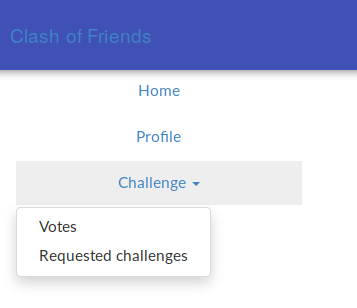

# Clash of Friends
_Julien Biefer, Léo Cortès et Johanna Melly_
_Janvier 2019_

## Description générale du projet
Le but de notre réseau social est de mettre en relation des utilisateurs afin qu'ils puissent se souffleter dans diverses catégories.
Un duel impliquerait deux utilisateurs qui se défient dans une catégorie donnée.

Un utilisateur peut proposer un challenge a un de ses amis. Il peut choisir diverses catégories : texte, image, son vidéo. Aléatoirement, le système va définir un format (nombre de char pour un texte par exemple), un thème ainsi qu'un temps limite pour procéder à l'upload de la ressource.

Une fois le challenge soumis, l'utilisateur provoqué en duel est libre d'accepter ou de refuser. S'il accepte, le même procédé est mit en route : il a un temps limite pour soumettre la ressource imposée en respectant le thème donné. Tous ces paramètres sont communs pour les deux duelistes (sinon on aurait pas de quoi les comparer).

Une fois que les deux duelistes ont soumis leur ressource pour le challenge, les autres utilisateurs, observateurs de cette bataille, auront une période pour voter sur le contenu proposé par les deux duelistes.

Un système d'amitié est mis en place. Chaque utilisateur est libre de suivre d'autres utilisateur. Notons qu'il est obligé de suivre un utilisateur pour lui proposer un challenge.

Les catégories sont déterminées selon le type de document à fournir. Pour chaque catégorie, plusieurs format sont possible (et déterminés aléatoirement par le système).

* **Texte**  : < 20, 50 ou 80 charactères
* **Photo** : Black'n'white, Square, Nude, Sepia, Portrait, Landscape, Selfie
* **Son** : < 5, 15, 30, 45 secondes
* **Vidéo** : < 5, 15, 30, 45 secondes

Finalement, un thème est défini aléatoirement entre les suivants : *Comedy, Love, Beauty, Lazyness, Friendship, Family, Motivation, Eagerness*

Un utilisateur a une page de profil sur laquelle il peut gérer diverses informations liées à son compte.

## Lancer le projet en local
1. Clonez le répo (no shit Sherlock)
2. Ouvrez un terminal dans le dossier */backend*
3. Lancez les commandes ``yarn install`` puis ``yarn start``
4. Ouvrez un terminal dans le dossier */frontend*
3. Lancez les commandes ``yarn install`` puis ``yarn start``

## Tester le projet à distance
1. Ouvrez votre navugateur favoris
2. Allez sur https://clash-of-friends.herokuapp.com/

## Utilisation
- Pour accéder à votre page de profil : via le menu de gauche ou en cliquant sur l'icone utilisateur en haut à droite

  - C'est depuis ici que vous pouvez modifier vos informations de profil
  - C'est également depuis ici que vous pouvez suivre d'autre utilisateurs
- Pour créer un challenge : choisissez la catégorie sur la grosse boîte prévue à ce ette effet sur la page d'accueil (franchement, vous pouvez pas la manquer).

  - Remplissez ensuite votre challenge avec le thème et format imposé dans le temps imparti

- Pour accéder au challenge sur lesquel on vous provoque : utilisez le menu de gauche
- Pour accéder à la page de vote des challenges : utilisez le menu de gauche

## L'API
// TODO

## Requêtes et données
// TODO

## Auto-évaluation
// TODO

Nous sommes partis sur un projet peut être un peu ambitieux. Ce système de challenges soulève beaucoup de questions et nécessite bien des étapes différentes. Les cas d'utilisations sont donc assez complexes. Toutes les fonctionnalités voulues n'ont pas pu être implémentées.

## Il reste à implémenter
Chaque utilisateur aurait un montant initial de point et ce dernier évoluerait selon les challenges gagnés ou perdus.

Un classement des utilisateurs pourra être établi sur tout le réseau social ou pour des catégories données.

Une page principale montrera les combats en cours ou passés.

Les utilisateurs auront une page de profile (« Mur ») où seront affiché leurs dernier combats ou les combats à venir, leur nombre de points, le nombre de joutes gagnées ou perdues, leur ratio victoire/défaite, nombre de relations,...

## Technologies utilisées
* Frontend : [React.js](https://reactjs.org)
* Backend : [GraphQL](https://graphql.org)
* Base de donnée : [MongoDB](https://www.mongodb.com)
